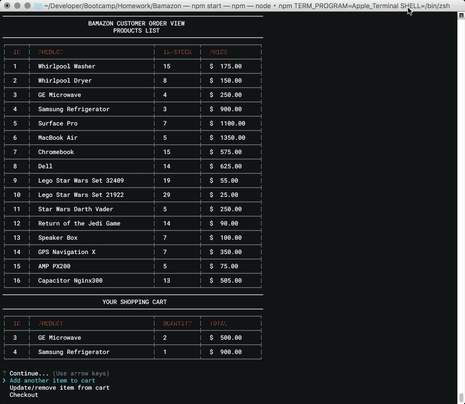

# Bamazon Node Storefront
----------

## Overview

Bamazon is a storefront sort of like Amazon but without any of the awesome features that the Amazon website offers. It runs through the terminal using Node along with data stored through a MySQL database connection. The application takes in customer order into a shopping cart and on checkout will process the information to the MySQL database depleting product stock.

----------

### Assignment Objectives
* Create an Amazon like storefront using Node and MySQL.
* Challenge 1 - Create a Customer View to shop for available products.
* Challenge 2 - Create Manager View to view products, low inventory report, add inventory or new products.
* Challenge 3 - Create an Executive View to view sales reports by department.

----------

## Installation

- Clone repo locally -> `cd` into project folder.

- Run `npm install` to locally install dependencies.

- Log into localhost mysql shell and source `BamazonDB.sql` file in order to create and load initial database data.

  - In mysql shell, this can be done using the command `source /FULL_PATH_HERE/BamazonDB.sql`

- Rename `EXAMPLE__keys.js` to `keys.js`.

- Inside `keys.js` file, provide values for your local mysql connection where the BamazonDB.sql file was sourced.

----------

### Challenge #1: Customer View (Minimum Requirement)

This is the original product list based on the dummy data retrieved from MySQL database.

When running `npm start`, the initial application loads an interface selection list where you are able to choose which view you would like to use. The interfaces correspond to the different levels in the assignment outline; Customer View, Manager View, or Executive View. Currently the only working interface is the Customer Portal. I plan on adding the Manager Portal and Executive Portal soon.

Upon entering the Customer Portal, there is a Product List table (Using NPM Package: cli-table) with columns ID, Product, In-Stock, and Price. This is pulled from localhost MySQL database connection. The bottom section is an empty Shopping Cart table. The customer is then able to add a product to their shopping cart by inputting the id of the product in the prompt followed by the quantity. These are validated based on the current product list id's and the in-stock value. The customer is only able to add products by id's that are on the product list table and may only add a quantity that is less than the in-stock value. Once validated, the item is now part of the shopping cart.

The customer is able to continue adding items to cart, update/remove items from cart, or proceed to checkout. This gif below demonstrates a customer adding a second item to their cart.

The checkout process is demonstrated below. The customer simply selects the Checkout option and their order is processed. They are given a printout with subtotal, tax, and total due. The order is sent to MySQL database where the in-stock values for the items in their shopping carts are updates to reflect the depleted stock after the purchase.

The gif below shows the local mysql database through user `bootcamp`. The database used for this assignment is Bamazon.

Here you'll see the tables displayed using the `SHOW TABLES;` command. The makeup of the `products` table is displayed using the `DESCRIBE products;` command.

Finally I run a query to select all from the products table for reference.

----------

### Challenge #2: Manager View

Not yet completed.

----------

### Challenge #3: Executive View

Not yet completed.

----------

## Copyright
Ronny Tomasetti (C) 2016. All Rights Reserved.
